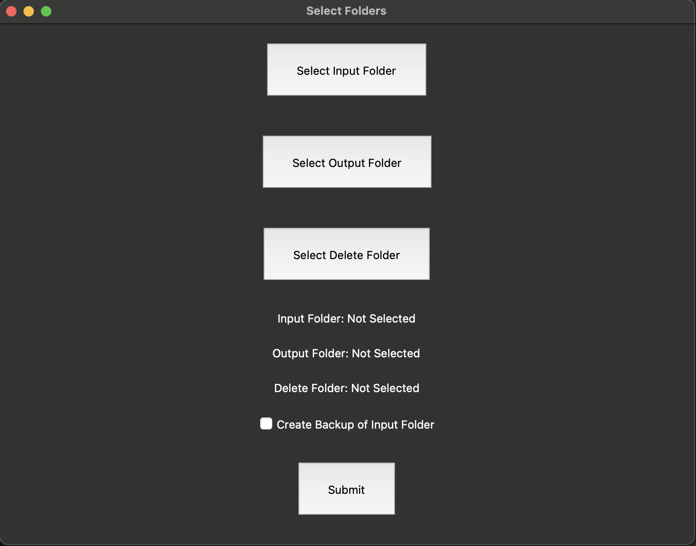
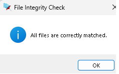
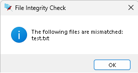
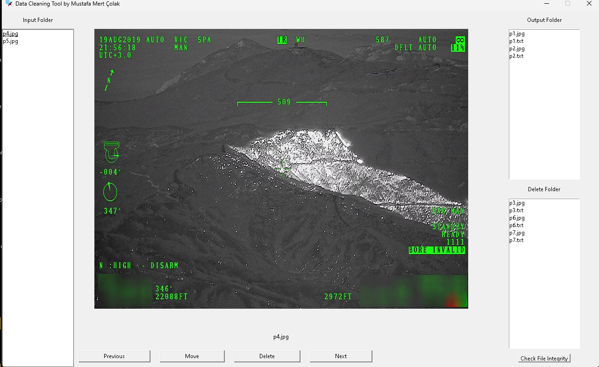
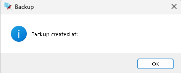

# Data Cleaning Tool by Mustafa Mert Çolak

Welcome to the **Data Cleaning Tool**, a powerful application designed to help you manage and clean image datasets for models like YOLO. This tool enables you to effortlessly organize and filter your images, ensuring that your dataset is optimized for training.


## Features

- **Folder Selection**: Easily select input, output, and delete folders to organize your images.
- **Backup Creation**: Optionally create backups of your input folder before making any changes.
- **Image Navigation**: Navigate through your images using next and previous buttons or arrow keys.
- **File Management**: Move images to the output folder, delete unwanted images, and check file integrity.
- **Intuitive UI**: User-friendly interface with visual feedback and easy-to-use controls.

## Getting Started

### Prerequisites

Ensure you have the following installed on your system:

- Python 3.x
- Tkinter
- Pillow

You can install the required Python packages using pip:

```bash
pip install tk pillow
```

### Running the Application

1. Clone this repository to your local machine:

```bash
git clone https://github.com/your-username/data-cleaning-tool.git
cd data-cleaning-tool
```

2. Run the application:

```bash
python data_cleaning_tool.py
```

### Using the Tool

1. **Select Folders**: Click on the "Select Folders" button to open the folder selection window. Choose your input, output, and delete folders. Optionally, check the "Create Backup of Input Folder" box to create a backup.



2. **Navigate Images**: Use the "Previous" and "Next" buttons or the arrow keys to browse through your images. The selected image will be displayed in the main window.


3. **Move or Delete Images**: Use the "Move" button to move the current image (and its corresponding .txt file, if any) to the output folder. Use the "Delete" button to move the current image to the delete folder.

4. **Check File Integrity**: Click the "Check File Integrity" button to verify that all images have corresponding .txt files and vice versa. Any mismatched files will be listed.





## Screenshots


*Main Interface: Select, navigate, and manage your images effortlessly.*

*Backup Notification: Create backups of your input folder before making changes.*



## Acknowledgements

- [Tkinter](https://docs.python.org/3/library/tkinter.html)
- [Pillow](https://python-pillow.org/)

---
